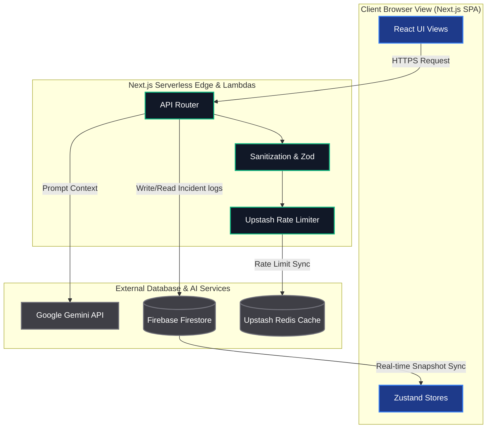
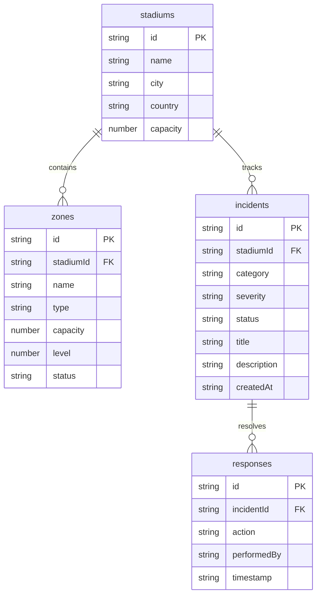
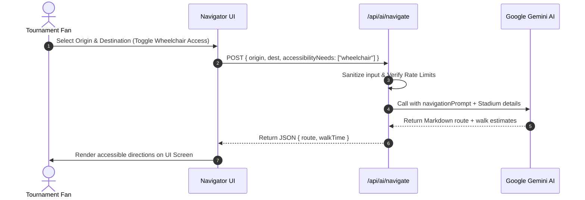
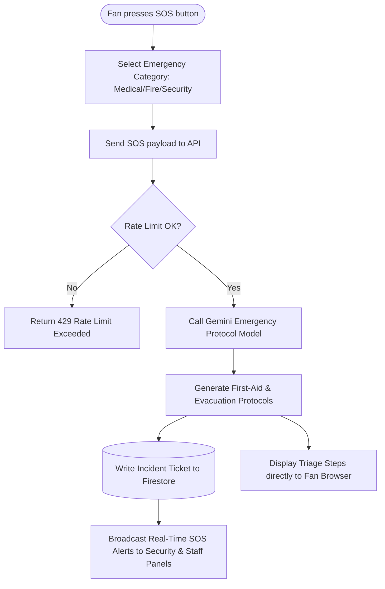

# 🏆 FIFA StadiumOS — Smart Stadium & Tournament Assistant

[](https://github.com/Thirumal143200/FIFA-World-Cup-2026-Smart-Stadium-GenAI)
[](LICENSE)
[](https://nextjs.org)
[](https://www.typescriptlang.org)
[](https://tailwindcss.com)
[](https://ai.google.dev/)
[](#accessibility)

**Live Production URL**: [https://fifa-stadium-ai-navy.vercel.app](https://fifa-stadium-ai-navy.vercel.app)

Next-Generation AI-powered operational and guest assistance platform built for the **FIFA World Cup 2026™** spanning USA, Mexico, and Canada.

---

## 📸 Screenshots & Interfaces

### 1. Unified Landing & Role Selector
```
┌────────────────────────────────────────────────────────┐
│ [⚽ FIFA Badge]                                        │
│               FIFA StadiumOS — 2026                    │
│                                                        │
│   Select Your Role:                                    │
│   ┌───────────────┐ ┌───────────────┐ ┌───────────────┐│
│   │  👥 Fan Hub   │ │  👮 Security  │ │  📊 Organizer ││
│   └───────────────┘ └───────────────┘ └───────────────┘│
│   ┌───────────────┐ ┌───────────────┐                  │
│   │   👷 Staff    │ │    🚨 SOS     │                  │
│   └───────────────┘ └───────────────┘                  │
└────────────────────────────────────────────────────────┘
```
*(Placeholder: `public/screenshots/landing-role-selector.png`)*

### 2. Fan AI Navigator & Accessibility Guides
```
┌────────────────────────────────────────────────────────┐
│ [📍 Navigation]  Select Route: Concourse A -> Sec 112  │
│ ────────────────────────────────────────────────────── │
│   ♿ Wheelchair Route Active                           │
│   Estimated walk time: 3 mins (avoiding Concourse B)   │
│                                                        │
│   AI Turn-by-Turn:                                     │
│   1. Head NW toward Concourse A Elevator.               │
│   2. Take elevator to Level 2.                         │
│   3. Section 112 is on your left past the first-aid.   │
└────────────────────────────────────────────────────────┘
```
*(Placeholder: `public/screenshots/fan-ai-navigator.png`)*

---

## 🏛️ System Architecture

FIFA StadiumOS integrates conversational AI, crowd flow forecasting, multi-modal transit coordination, accessibility adaptations, and real-time emergency guidance into one unified command panel.



---

## 🗄️ Database Schema & ER Diagram

The Firestore database maps stadium configurations, zones, and real-time incident ticketing.



---

## 🔄 System Workflows & API Flow

### 1. Fan Navigation & Accessibility Query Workflow


### 2. Emergency SOS Incident Logging & Dispatch Workflow


---

## 🧠 Specialized Gemini AI Modules

StadiumOS relies on Google Gemini API to power 8 dedicated operational intelligence engines:

1. **AI Stadium Navigator**: Explains turn-by-turn routes inside venues with relative landmarks and walk times.
2. **Crowd Intelligence**: Predicts peak concourse density changes and generates logistic redirection recommendations.
3. **Multilingual Assistant**: Natural conversation assistance supporting 30+ participant nation languages.
4. **Accessibility Advisor**: Automatically adapts navigational instructions to Visual, Auditory, and Mobility Needs.
5. **Emergency Guide (SOS)**: Displays step-by-step first-aid and evacuation protocols during critical safety alerts.
6. **Transport Optimizer**: Recommends multi-modal transit selections based on traffic flow and schedule data.
7. **Sustainability Engine**: Calculates journey carbon footprints and advises eco-diverted actions.
8. **Operational Intelligence**: Provides strategic staffing levels and event risk scores to organizers.

---

## 💻 Tech Stack

- **Framework**: Next.js 16 (App Router)
- **Styling**: Tailwind CSS 4, Lucide Icons, Framer Motion
- **Database / Auth**: Firebase SDK (Firestore real-time telemetry, Authentication)
- **AI Core**: Google Gemini Generative AI SDK (`gemini-2.0-flash`)
- **Rate Limiting**: Upstash Redis (production-grade sliding window)

---

## 🚀 Quick Start

### 1. Clone the Repository
```bash
git clone https://github.com/Thirumal143200/FIFA-World-Cup-2026-Smart-Stadium-GenAI.git
cd FIFA-World-Cup-2026-Smart-Stadium-GenAI
```

### 2. Configure Environment Variables
Create `.env.local` in the project root:
```env
NEXT_PUBLIC_FIREBASE_API_KEY=your-firebase-api-key
NEXT_PUBLIC_FIREBASE_PROJECT_ID=your-firebase-project-id
GEMINI_API_KEY=your-gemini-api-key
```

### 3. Run Development Server
```bash
npm install
npm run dev
```
Open [http://localhost:3000](http://localhost:3000) to view the application.

---

## 📋 Deployment & Submission Checklists

### 1. Deployment Checklist (Vercel)
- [ ] Connect the GitHub repository to your Vercel Dashboard.
- [ ] Add the following Environment Variables in Vercel Settings:
  - `NEXT_PUBLIC_FIREBASE_API_KEY`
  - `NEXT_PUBLIC_FIREBASE_PROJECT_ID`
  - `GEMINI_API_KEY`
  - `UPSTASH_REDIS_REST_URL`
  - `UPSTASH_REDIS_REST_TOKEN`
- [ ] Set build framework preset to **Next.js**.
- [ ] Deploy. The deployment should build successfully with zero errors.

### 2. Submission Verification Checklist
- [ ] Run type check (`npx tsc --noEmit`) and verify zero errors.
- [ ] Run linter (`npm run lint`) and verify zero warnings/errors.
- [ ] Run test suite (`npm test`) and verify 21/21 passing tests.
- [ ] Run production compiler (`npm run build`) and confirm compiler optimization.
- [ ] Verify that no secrets or API keys are committed in any file.

---

## 📜 License
This project is licensed under the MIT License - see the [LICENSE](LICENSE) file for details.
